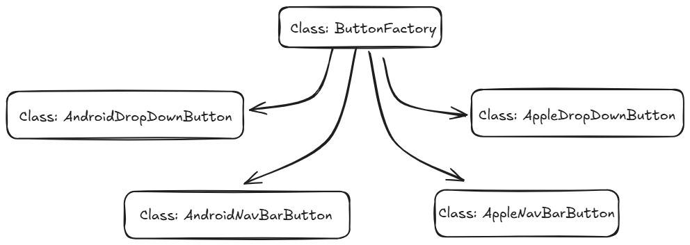
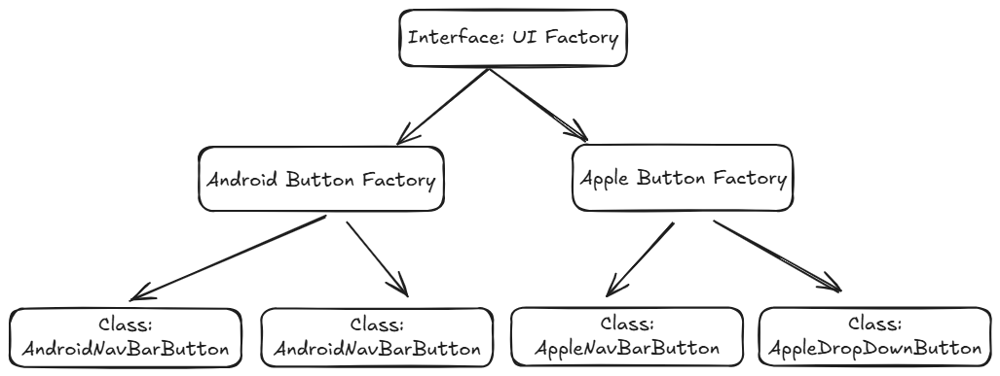

# Abstract Factory Pattern
### Definition
Provides an interface for creating families of related or dependent objects without specifying their concrete classes

### Example: 
Let us expand on the example we considered in the [Factory Pattern](../Factory/Factory.md).

#### Problem
Suppose you want to support platform specific UI: iOS and Android (or build support for Day and Night theme also work, we're sticking with the platform example).

A naive solution may be to modify the [ButtonFactory](../Factory/Factory.md#L61). Adding new methods for each ecosystem. 



```java
class ButtonFactory {
    public static Button createAndroidButton(String type) {
        if(type.equals("navBar")) return new AndroidNavBarButton(color: "blue");
        if(type.equals("dropDown")) return new AndroidDropDownButton(color:"red");
        return new AndroidDefaultButton(color:"green");
    }
    
    public static Button createAppleButton(String type) {
        if(type.equals("navBar")) return new AppleNavBarButton(color: "blue");
        if(type.equals("dropDown")) return new AppleDropDownButton(color:"red");
        return new AppleDefaultButton(color:"green");
    }
}
```
But this causes other issues:

1. Violates the Open/Close Principle
2. Violates Dependency inversion
3. Makes the code more dependent on the individual functions being called (bringing us full circle to the initial problem of instantiating new buttons every time one was needed)


#### Solution using the Pattern:
We create an interface `UIFactory`, this defines every UI element common to both ecosystems (we're only considering the buttons, but the actual UIFactory will include everything from navbars to symbols and fonts).

```java
public interface UIFactory {
    Button createButton();
}
```

Each ecosystem get's its own concrete factory. 

One for the Android Ecosystem:

```java
class AndroidButtonFactory implements UIFactory{
    public static Button createButton(String type) {
        if(type.equals("navBar")) return new AndroidNavBarButton(color: "blue");
        if(type.equals("dropDown")) return new AndroidDropDownButton(color:"red");
        return new AndroidDefaultButton(color:"green");
    }
}
```

Another for the iOS Ecosystem:

```java
class AppleButtonFactory implements UIFactory{
    public static Button createButton(String type) {
        if(type.equals("navBar")) return new AppleNavBarButton(color: "blue");
        if(type.equals("dropDown")) return new AppleDropDownButton(color:"red");
        return new AppleDefaultButton(color:"green");
    }
}
```

#### Implementation Flow details:




Here we subtly modify the code we wrote in the Factory pattern. Using another function `getPlatformSpecificFactory()`, to get the playform specific factory object .

```java
class UI {
    public void display(){
        Factory buttonFactory = new getPlatformSpecificFactory();
        // navbar
        homeElement.add(buttonFactory.createButton("navBar"));

        // dropdown
        for(Options o: dropDownOptions) {
            o.addElement(buttonFactory.createButton("dropDown")); 
        }

    }
}
```

Here we can ask a question, who is `actually` making the decision on what objects to create? 
Well, the answer is the specific Factory that was selected.
Who selected the factory? The `User`, as in the platform the user is using, one that they `choose`.

This ensures that all UI components for a platform are created consistently and allows future ecosystems to be added without breaking existing logic.

### Key Concepts:
1. **Family of Related Objects**
The main point of this pattern is to group objects into common categories. (Single Factory was helping is get a specific type of button. Abstract Factory helps us to get a specific type of button under a specific ecosystem).

2. **Open/Closed Principle**
New platforms or themes can be supported by adding new factory classes no modification to existing logic is needed.

3. **Dependency Inversion Principle**
Clients rely on interfaces (like UIFactory), not on concrete implementations.

4. **Inheritance Based Design**
Abstract Factory typically involves inheritance to enforce structure across related object groups.

5. **Structure vs Flexibility**
Abstract Factory brings structure (inheritance), while regular Factory allows more flexibility (composition).

### Code
