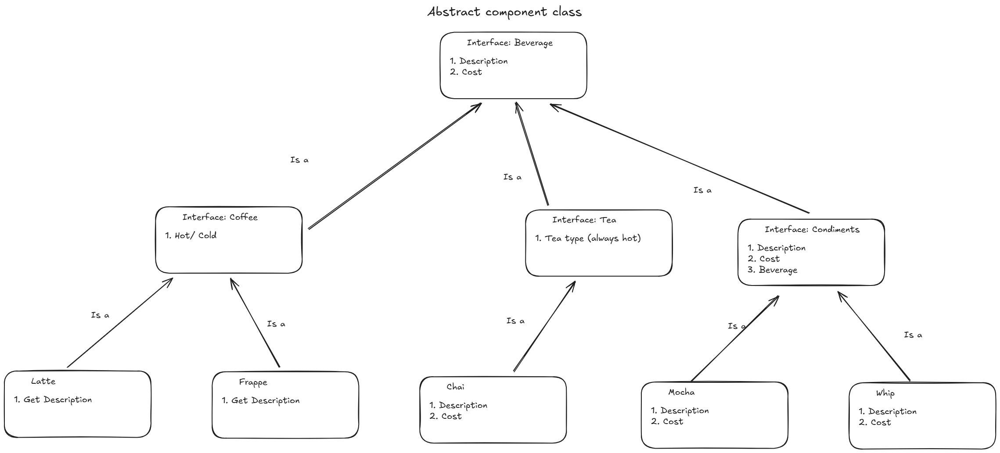

# Decorator Pattern

### Definition

The **Decorator Pattern** attaches additional responsibilities to an object dynamically. It provides a flexible alternative to subclassing for extending functionality

It is espcially suited for cases in which changes can happen in multiple ways/ sequences creating a combinatorial explosion for inheritance.

It also allows for a stricter adherence to the **Open/Closed Principle**, objects should be open for extension but closed for modification.

---

### Example: Cafe Ordering System

Suppose we are building a coffee shop app that allows users to select base beverages like **Latte**, **Chai**, or **Frappe**, and then add **Condiments** like **Mocha** or **Whip** dynamically.

Instead of having a combinatorial explosion of subclasses (e.g., LatteWith`Mocha`And`Whip` and LatteWith`Whip`And`Mocha` or LatteWith`DoubleWhip`), we use can use decorators to build these compositions at run time.

<figure>
  
  <figcaption>Example of combinatorial explosion</figcaption>
</figure>

---

### UML Diagram

#### Components:
- `Interface: Beverage` is the abstract component class, declaring:
  - `getDescription()`
  - `cost()`

- `Interface: Coffee` and `Interface: Tea` are specialized subtypes of Beverage.
  - `Coffee`: can be hot or cold
  - `Tea`: always hot

- Concrete beverages like `Latte`, `Frappe`, and `Chai` implement their own logic.

- `Interface: Condiments` is a **Decorator**, also implementing `Beverage`, but with an added reference to the `Beverage` being wrapped.

- `Mocha` and `Whip` are concrete decorators that add description and cost on top of the base drink.

---
### Implementation Flow
Here we first create an object for the drink (Latte, Frappe and so on). Then as more condiments are added, each condiment acts as a wrapper of sorts for the object provided to it.

Containing the beverage object, providing it's own set of methods for the same.

When the cost method is called, the wrappers will add their own cost to the cost of the object they contain. This results in the outermost object returning the cost of the total beverage, regardless of the actual arrangement or composition of the wrappers.

### Issues with the pattern:
Let's say that we have a discount running for the coffee. Here there is no easy way to modify the code to account for this, as any changes to the coffee will not ripple out to the cost of the total beverage.
#### Limitations:
- **Depth of wrapper chains**: Too many wrappers make debugging difficult
- **Difficulty in error recovery**
- **No Back Propogation**: A 20% off on all Lattes must be applied at the root level not on the Latte definition level, violating the Open Closed principle.

### Key Concepts:
- **Flexible Composition**
- **Reusability**
- **Clean Separation**
- **Open/ Closed Principle**

### Code